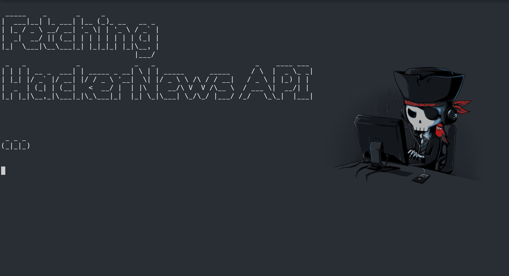
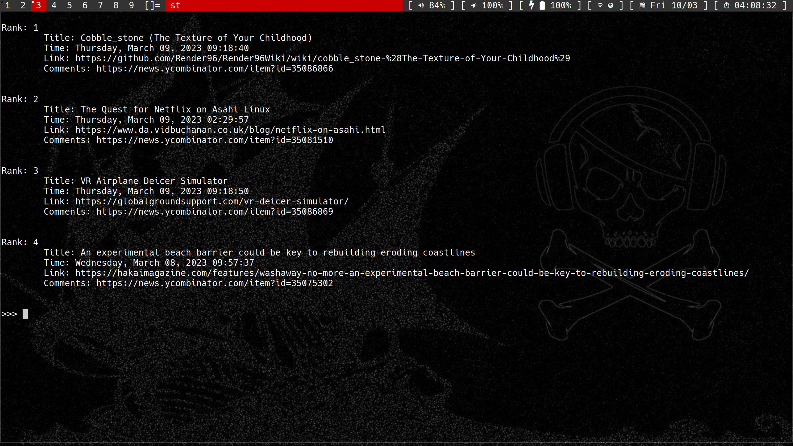

# hackernewscli
> hackernews on the terminal
## Usage
````
:: Edit src/hackernewscli/configs.py
:: You can use '$stty -a' to lookup the tty rows size
:: Deploy to /opt or ~/library (or somewhere else)
:: Run ./scripts/run.py
:: Vim like commands
    j forward,
    k back, jn (or kn) for n number of pages to move,
    q quit, r refresh,
    n where n is the number of the article to open on browser
        (set by $BROWSER env var)
    &n for hackernews comment section on browser
````
</img>
</img>
## TODO
[ ] Add tests
